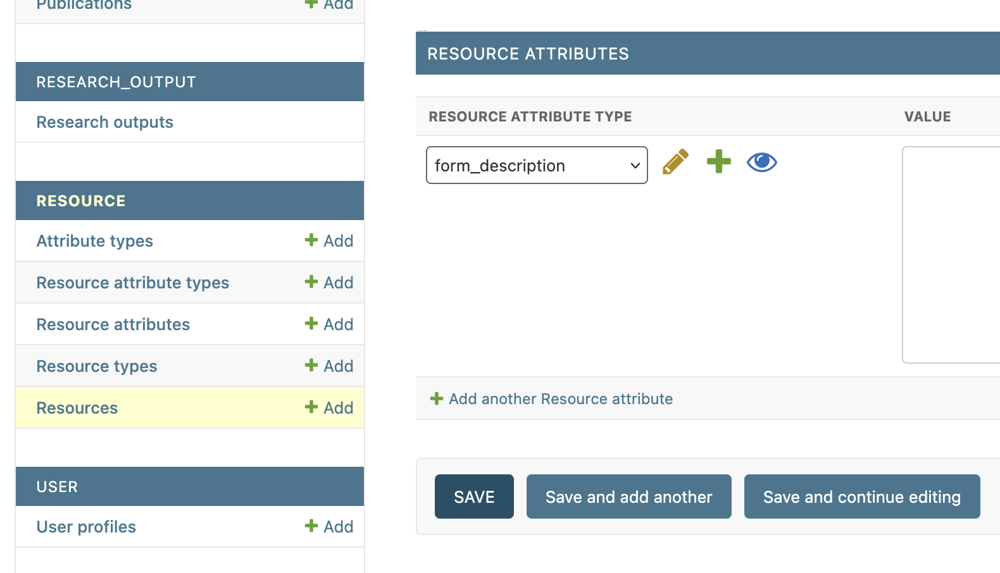
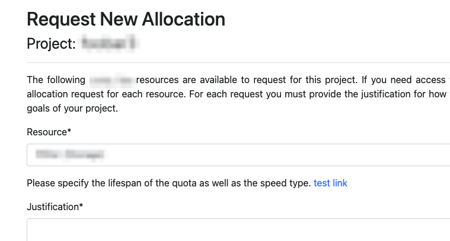

# Allocation Create Form Customization

## Resource Description
When requesting a new allocation, it is possible to display a description for the currently selected resource.

To define a description, navigate to the `RESOURCE > Resource` page in the Django admin interface, select a resource, scroll down to the `RESOURCE ATTRIBUTES` section, and then create a new resource attribute of type `form_description`:



In the following example, the value for `form_description` is:

```html
Please specify the lifespan of the quota as well as the speed type.
<a href="">test link</a>
```

And here it is in the allocation create form:



The description is displayed as raw HTML. This means that you can include hyperlinks or even images.

## Coming Soon
There are plans to implement more allocation form customization features in the future, such as [automatic allocation attribute creation](https://github.com/coldfront/coldfront/issues/669).
